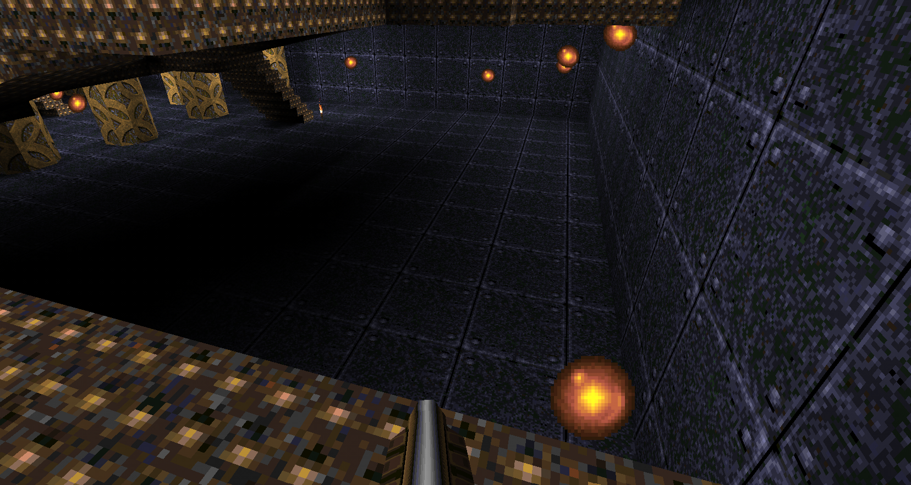
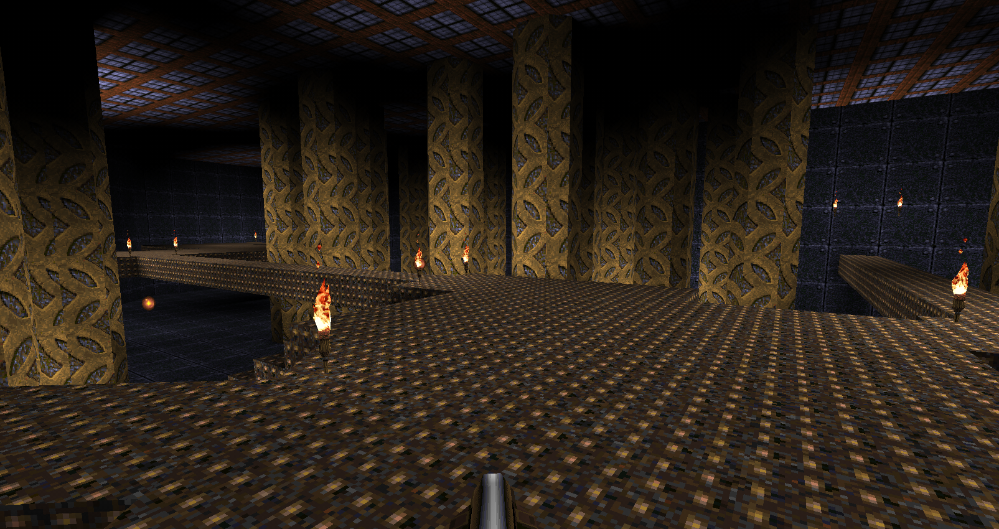

# Lighting

## Immersion and Theme

A goal of my lighting was to enhance the mood of the level and support the overall theme. I used lighting to make certain areas feel more dramatic and visually interesting.

In this section, the lighting adds depth and atmosphere to the space, helping reinforce the tone of the environment and making it feel more immersive.

---

## Guidance and Orientation

Lighting was also used to guide the player and highlight important areas. Brighter areas tend to indicate where the player should go next.

In this example, lighting is used to draw the player’s attention toward a specific path. This supports player orientation and helps prevent confusion during gameplay.
